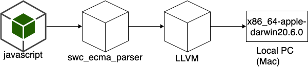

# rustscript
A Toy Javascript Compiler that parses javascript and compiles JIT with LLVM([Rust:inkwell](https://github.com/TheDan64/inkwell/)).



# environment

```
$ sw_vers
ProductName:    macOS
ProductVersion: 11.6
BuildVersion:   20G165
$ cargo --version && rustc --version
cargo 1.56.0-nightly (18751dd3f 2021-09-01)
rustc 1.56.0-nightly (50171c310 2021-09-01)
```

# development

```
$ cargo run
```

# laboratory

Lab to output ll files easily from C language.

# link

* [LLVM入門 - javascriptをLLVM(Rust:inkwell)でJITコンパイルするまで - silverbirder](https://silver-birder.github.io/blog/contents/intro_to_LLVM-JIT_compilation_of_javascript_with_LLVM_Rust_inkwell)